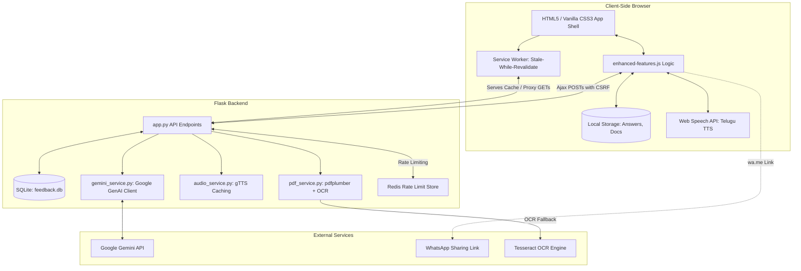
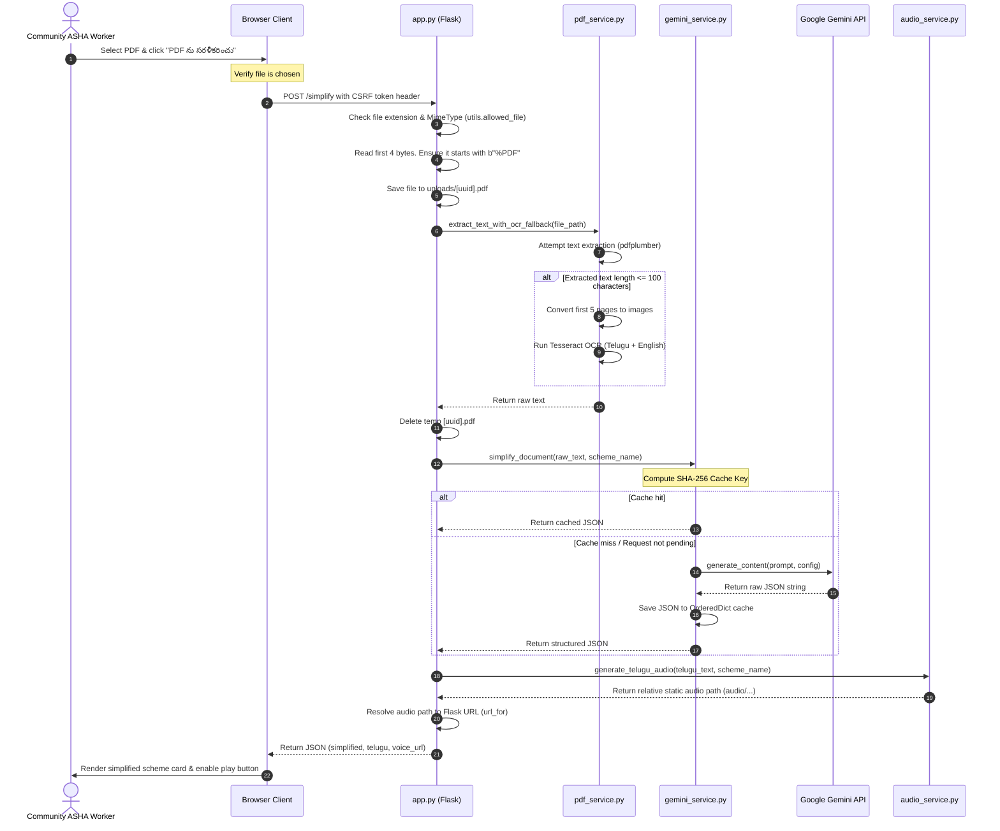
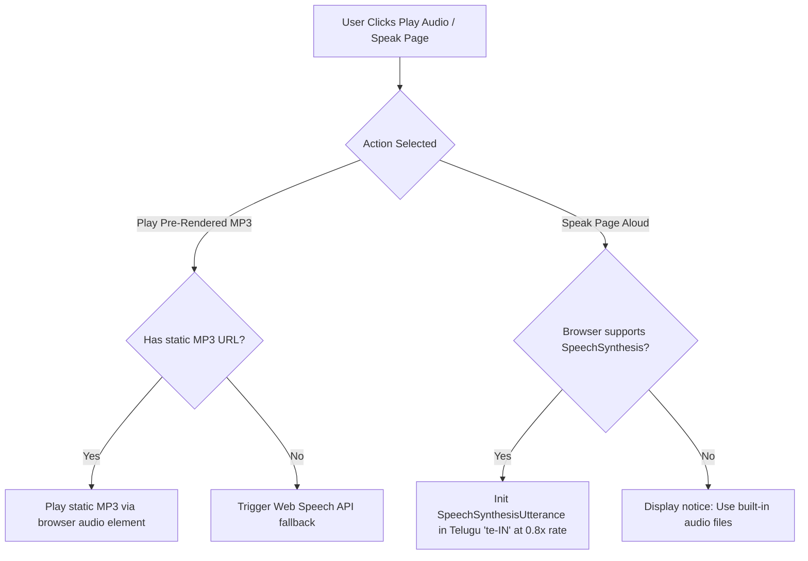
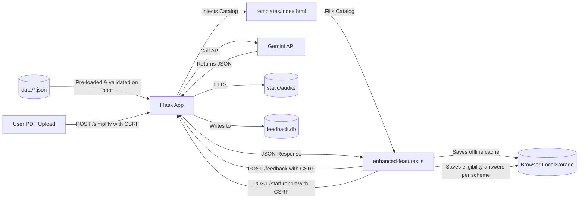

# Codebase Review & Architecture Report: SmartGov Health

This document provides a comprehensive, senior software engineering analysis of the **SmartGov Health** codebase. It outlines the project's purpose, architectural design, component layouts, data and execution flows, and external integrations.

---

## 1. Project Purpose & Target Audience

**SmartGov Health** is a portfolio-ready, offline-first Progressive Web App (PWA) with a Python Flask backend. Its primary mission is to democratize access to state and national healthcare welfare schemes for citizens in rural Andhra Pradesh, India. 

### Key Design Considerations for Low-Literacy & Rural Audiences:
* **Telugu-First Interface:** The default UI, audio assistance, and search system prioritize Telugu (the regional language), lowering the literacy barrier.
* **Accessible UI (Touch-Friendly):** All buttons exceed the **48px (12mm)** physical touch target guideline (ranging from 52px to 56px) with generous padding to prevent mis-taps ("fat-finger friendly").
* **Full Voice Assistance:** The app integrates dual-layer audio (pre-generated high-quality gTTS MP3s served locally, with a dynamic client-side `Web Speech API` Telugu text-to-speech fallback) so users can listen rather than read.
* **Offline-First Mode:** Designed to operate in locations with unstable internet. Static assets and scheme data are aggressively cached using service workers and browser `localStorage`.
* **Zero-Trust Client Data Storage:** No personal identifiable information (PII) like Aadhaar, phone numbers, or health cards is uploaded or stored on the server. All checklists, eligibility checks, and form entries are saved purely inside the client's browser using `localStorage`.

---

## 2. System Architecture

SmartGov Health follows a classic decoupled client-server architecture, reinforced with Progressive Web App features for local persistence and offline operations.



### Key Architectural Concepts:
1. **Offline PWA Proxy:** The Service Worker intercepts GET requests. If the network is unavailable, it answers immediately using the local Cache Storage.
2. **Deterministic Audio Caching:** Pre-generated audio files are stored in `static/audio/`. The application looks up files based on a SHA-256 hash of the Telugu spoken content. It only initiates a runtime gTTS API call if the file is completely missing, saving significant bandwidth and API usage.
3. **Concurrent Request De-duplication (AI Client):** When multiple threads request simplification of the same PDF content, `gemini_service.py` blocks duplicate requests using a thread lock and wait events, protecting the API key from rate limits.
4. **Resilient Rate Limiting:** Flask-Limiter is configured to use Redis in production if `REDIS_URL` is set, falling back automatically and gracefully to in-memory storage if Redis is down.

---

## 3. Folder Structure & Path Reference

Below is a detailed breakdown of the file structure in the repository:

```
SmartGovAI-2026/
├── .env.example                  # Template for environment variables (Secret keys)
├── Dockerfile                    # Container definition for reproducible packaging
├── docker-compose.yml            # Compose configurations for multi-service environments
├── data/
│   ├── health.json               # Health schemes data catalog
│   └── scheme_schema.json        # Schema validation rules for catalog entries
├── app.py                        # Core Flask application, routing, and HTTP pipeline
├── config.py                     # Centralized settings and environment loader
├── database.py                   # SQLite tables, helper functions, and schema definition
├── logger_config.py              # Structured logging basic config
├── utils.py                      # Input/file upload validation functions
├── requirements.txt              # Primary project dependencies
├── pytest.ini                    # Pytest framework configuration settings
├── docs/
│   └── ENGINEERING_AUDIT.md      # High-level developer assessment & technical debt audit
├── services/
│   ├── __init__.py
│   ├── audio_service.py          # gTTS wrapper, audio hash generator, and cleanup (Flask independent)
│   ├── gemini_service.py         # Google Gemini Client, request de-duplication, thread-safe cache
│   └── pdf_service.py            # PDF parser (pdfplumber) with Tesseract OCR fallback
├── static/
│   ├── audio/                    # Directory for generated or pre-cached MP3 voice files
│   ├── enhanced-features.js      # Frontend controller (TTS, checklists, storage, reports, event delegation)
│   ├── icon.svg                  # Application brand icon
│   ├── manifest.webmanifest      # PWA installation details
│   ├── service-worker.js         # Service worker file caching and pre-caching mechanism
│   └── style.css                 # Vanilla CSS, grid variables, dynamic layouts, button sizes
├── templates/
│   ├── index.html                # Main application UI template (Jinja2)
│   ├── offline.html              # Fallback page when client is completely disconnected
│   └── analytics.html            # Admin feedback stats rendering template
├── tests/                        # Pytest unit tests
│   ├── conftest.py               # Shared test fixtures (mock files, dummy data)
│   ├── test_app.py               # API route, response structure, and validation unit tests
│   ├── test_audio_service.py     # Hashing and file generation unit tests
│   ├── test_gemini_service.py    # Request collapsing and caching unit tests
│   ├── test_pdf_service.py       # Plumber parsing & OCR fallback unit tests
│   └── test_utils.py             # File extension, mimetype validation tests
└── scripts/
    ├── QUICKSTART.py             # Help/FAQ developer CLI printout
    ├── enhance_schemes.py        # Populates data/health.json with questions & locations
    ├── generate_audio.py         # Standalone utility to pre-render Telugu voice MP3 files
    └── view_db.py                # Admin helper script to query SQLite requests/feedback
```

---

## 4. Key File Explanations & Responsibilities

### Core Execution Modules:
* **[app.py](file:///c:/Users/HP/OneDrive/Desktop/SmartGovAI-2026/app.py):**
  * Initializes the Flask app, setups middleware to record performance, sets security headers (nosniff, SAMEORIGIN, CSP, Referrer-Policy, Permissions-Policy), activates CSRF protection (Flask-WTF), Rate Limiting (Flask-Limiter), and handles API routes and error pages (404, 413, 500).
* **[config.py](file:///c:/Users/HP/OneDrive/Desktop/SmartGovAI-2026/config.py):**
  * Reads the `.env` file via `dotenv`. Exports global settings: directories (`BASE_DIR`, `UPLOAD_DIR`, `AUDIO_DIR`, `SCHEMES_DIR`), file constraints (`MAX_UPLOAD_SIZE = 5MB`, `ALLOWED_EXTENSIONS = {"pdf"}`), models (`gemini-2.5-flash`), and languages (`tel+eng`, `te`).
* **[database.py](file:///c:/Users/HP/OneDrive/Desktop/SmartGovAI-2026/database.py):**
  * Manages the SQLite database connection using a thread-safe connection context manager (`get_connection`). Initializes all tables (`requests`, `feedback`, `whatsapp_shares`, `staff_feedback`) and handles insertions.

### Services Layer (Logic):
* **[services/pdf_service.py](file:///c:/Users/HP/OneDrive/Desktop/SmartGovAI-2026/services/pdf_service.py):**
  * Handles local document ingestion. First attempts layout-based text parsing using `pdfplumber`. If the resulting text is under 100 characters (indicating a scanned image), it falls back to converting the first 5 pages (`MAX_OCR_PAGES`) to images using `pdf2image` and parsing them via `pytesseract` with Telugu and English language sets (`tel+eng`).
* **[services/gemini_service.py](file:///c:/Users/HP/OneDrive/Desktop/SmartGovAI-2026/services/gemini_service.py):**
  * Integrates the new `google-genai` SDK. Wraps API calls to Google's model with a thread-safe cache (`OrderedDict` capped at 64 entries) and a request-collapsing mechanism. If multiple users query the same document simultaneously, threads block on a `threading.Event()` and reuse the single outbound API response.
* **[services/audio_service.py](file:///c:/Users/HP/OneDrive/Desktop/SmartGovAI-2026/services/audio_service.py):**
  * Builds Telugu voice scripts by concatenating eligibility, benefits, documents, and steps. Fully decoupled from Flask's `url_for` contexts. Returns relative file paths (`audio/filename.mp3`). Also provides a `cleanup_old_audio` background cleaner.

### Frontend Components:
* **[templates/index.html](file:///c:/Users/HP/OneDrive/Desktop/SmartGovAI-2026/templates/index.html):**
  * The main UI. Embeds `schemesCatalog` directly into JavaScript on load. Sets up event handlers for search (using a fuzzy voice matching function with debounced inputs), and renders details inside the result panel.
* **[static/enhanced-features.js](file:///c:/Users/HP/OneDrive/Desktop/SmartGovAI-2026/static/enhanced-features.js):**
  * Implements browser SpeechSynthesis, handles interactive eligibility checklists, maintains local state in `localStorage` for forms, builds shareable text vectors, and performs client-side fallback triggers when network status shifts. Uses event delegation on `#resultArea` to fully eliminate inline JavaScript event handlers.
* **[static/service-worker.js](file:///c:/Users/HP/OneDrive/Desktop/SmartGovAI-2026/static/service-worker.js):**
  * Implements a **Stale-While-Revalidate** network strategy. Intercepts fetch requests, serves cached assets instantly, runs a network check in the background to fetch updates, and updates the cache. Automatically serves `/offline.html` if the navigation request fails.

---

## 5. Module Relationships & Dependencies


---

## 6. Detailed Execution Flows

### A. Startup Sequence

1. **Environment Setup & Activation:** 
   * The user runs `setup.bat` or `setup.py` to create a virtual environment (`myenv` or `.venv`) and install python packages in `requirements.txt`.
2. **Pre-caching Audio:** 
   * `setup.py` / `setup.bat` runs `python -m scripts.generate_audio`.
   * `generate_audio.py` scans `data/*.json`, loads active schemes, validates schema requirements, and runs `gTTS` to save static MP3s into `static/audio/` if they do not already exist.
3. **Web Server Instantiation:** 
   * The user triggers `start_app.bat` or `python app.py`.
   * `app.py` loads `config.py` (which reads `.env`).
   * Calls `database.init_db()` to verify that `feedback.db` exists and contains all active tables.
   * Creates upload/audio folders if missing.
   * Scans `data/*.json` to load and merge all valid schemes into the in-memory catalog, skipping malformed entries.
   * Logs available integrations: Gemini API status and Tesseract OCR availability.
   * Starts the Flask WSGI server at `http://localhost:5000`.

---

### B. PDF Ingestion & AI Simplification Pipeline

When a community worker uploads a government PDF document for simplification:



---

### C. Voice Synthesis Strategy

For audio delivery, the app uses a dual-layer strategy:



---

## 7. Data Flow Map



---

## 8. Database Schema & Storage Interactions

The application uses an SQLite database named `feedback.db` (path editable via config/environment variables) to log user engagements and store reports from health workers.

### Schema Details:

#### 1. `requests`
*Logs each lookup event for auditing and stats.*
```sql
CREATE TABLE requests (
    id INTEGER PRIMARY KEY AUTOINCREMENT,
    scheme_name TEXT,
    source TEXT,         -- 'catalog' or 'pdf'
    timestamp TEXT       -- ISO 8601 UTC
);
```

#### 2. `feedback`
*Logs ratings and text reviews.*
```sql
CREATE TABLE feedback (
    id INTEGER PRIMARY KEY AUTOINCREMENT,
    request_id INTEGER,
    rating INTEGER,      -- 1 to 5
    comment TEXT,
    timestamp TEXT,
    FOREIGN KEY (request_id) REFERENCES requests(id) ON DELETE CASCADE
);
```

#### 3. `eligibility_checks`
*Logs anonymized inputs to eligibility questions for volume tracking.*
```sql
CREATE TABLE eligibility_checks (
    id INTEGER PRIMARY KEY AUTOINCREMENT,
    user_session TEXT,
    scheme_name TEXT,
    answers TEXT,        -- JSON string of answers
    timestamp TEXT
);
```

#### 4. `document_checklist`
*Stores checklist logs.*
```sql
CREATE TABLE document_checklist (
    id INTEGER PRIMARY KEY AUTOINCREMENT,
    user_session TEXT,
    scheme_name TEXT,
    documents_checked TEXT, -- JSON string
    timestamp TEXT
);
```

#### 5. `whatsapp_shares`
*Logs sharing frequency.*
```sql
CREATE TABLE whatsapp_shares (
    id INTEGER PRIMARY KEY AUTOINCREMENT,
    scheme_name TEXT,
    timestamp TEXT
);
```

#### 6. `staff_feedback`
*Saves reports submitted by ASHA/ANM workers regarding incorrect scheme info.*
```sql
CREATE TABLE staff_feedback (
    id INTEGER PRIMARY KEY AUTOINCREMENT,
    scheme_name TEXT,
    village TEXT,
    feedback_text TEXT,
    issue_type TEXT,     -- e.g., 'wrong_info', 'missing_contact'
    timestamp TEXT
);
```

---

## 9. API Reference

All backend communication occurs via the following JSON endpoints:

| Endpoint | Method | Input Format | Output Format | Description |
| :--- | :--- | :--- | :--- | :--- |
| `/` | `GET` | Query params | HTML | Serves the main application landing page. |
| `/offline.html` | `GET` | None | HTML | Fallback template served by Service Worker when client is offline. |
| `/healthz` \| `/health` | `GET` | None | JSON | Returns system health, loaded schemes, directory write statuses, and uptime. |
| `/version` | `GET` | None | JSON | Returns API metadata (version, description). |
| `/simplify` | `POST` | `multipart/form-data` with `document` (PDF) OR JSON `{ "scheme_name": "..." }` | JSON | Takes a PDF, runs extraction and Gemini simplification, returns Telugu/English simplified texts and audio path. If JSON scheme name is sent, fetches data from static catalog. Protected by Rate Limiter. |
| `/eligibility-check` | `POST` | JSON: `{ "scheme_name": "...", "answers": {"0": "yes", "1": "no"} }` | JSON | Computes eligibility percentage based on question weights. |
| `/document-checklist` | `GET` | Query param `?scheme_name=...` | JSON | Returns required documents list, Telugu translations, and warnings. |
| `/whatsapp-share` | `POST` | JSON: `{ "scheme_name": "..." }` | JSON | Generates pre-formatted Telugu text and a URL for direct WhatsApp sharing. Protected by CSRF token. |
| `/enhanced-feedback` | `POST` | JSON: `{ "request_id": 12, "rating": 5, "comment": "..." }` | JSON | Stores structured ratings and survey feedback. Protected by Rate Limiter and CSRF token. |
| `/staff-report` | `POST` | JSON: `{ "scheme_name": "...", "feedback_type": "...", "village": "...", "feedback_text": "..." }` | JSON | Saves errors reported by community health workers. Protected by Rate Limiter and CSRF token. |
| `/local-locations` | `GET` | Query params `?scheme_name=...&village=...` | JSON | Returns addresses of nearest hospitals/PHCs based on selected scheme. |
| `/offline-cache` | `GET` | None | JSON | Returns complete scheme metadata, categories, and emergency phone numbers for offline storage. |

---

## 10. AI & Simplification Engine

The AI integration layer uses the Google Gemini API to simplify complex government documents.

### The System Prompt:
```
You simplify Indian government health scheme documents for rural Andhra Pradesh citizens.

Scheme/document name: {scheme_name}
Text:
"""{complex_text}"""

Return simple, accurate information. Do not invent benefits that are not present in the text.
Use easy English, then translate to clear Telugu.

Return strictly this JSON object:
{
    "simplified": {
        "eligibility": "Who can apply?",
        "benefits": "What do they get?",
        "documents": "What documents are needed?",
        "steps": "How to apply step by step?"
    },
    "telugu": {
        "eligibility": "Telugu translation of eligibility",
        "benefits": "Telugu translation of benefits",
        "documents": "Telugu translation of documents",
        "steps": "Telugu translation of steps"
    }
}
```

### Safety & Guardrails:
1. **JSON Mode enforcement:** Utilizes `response_mime_type="application/json"` in the Gemini Client configurations to prevent parsing failures.
2. **Temperature control:** Fixed at `0.2` to minimize hallucinations and keep responses factual.
3. **Timeout limit:** Network timeout is set to `15.0` seconds to avoid thread blocking.
4. **Offline safety:** If `GEMINI_API_KEY` is not present, `/simplify` falls back gracefully, and the UI displays a message explaining that PDF uploading is unavailable while keeping the local catalog operational.

---

## 11. External Dependencies

| Library | Role | Details |
| :--- | :--- | :--- |
| **Flask** | Web Application Framework | Handles routing, templates (Jinja2), and HTTP pipeline. |
| **google-genai** | Google Gemini Client SDK | Handles content generation and JSON schema controls. |
| **pdfplumber** | PDF Text Extractor | Extracts structured text from machine-readable PDF layouts. |
| **pdf2image** | PDF to Image Converter | Converts scanned PDF pages to PNG/JPEG for OCR. |
| **pytesseract** | OCR Engine Wrapper | Runs optical character recognition for scanned texts. |
| **gTTS** | Google Text-to-Speech | Standalone voice generator to create Telugu audio files. |
| **python-dotenv** | Environment Variable Loader | Loads variables from `.env` on app boot. |
| **Flask-WTF** | CSRF Protection | Enforces anti-forgery token checks on state-changing API endpoints. |
| **Flask-Limiter** | Rate Limiting | Implements request throttling to protect endpoints from DoS. |
| **sqlite3** | Embedded Database | Local SQL database driver included in Python Standard Library. |
| **pytest** / **pytest-cov** | Testing frameworks | Standard test runner and coverage reporter (current coverage: 86%). |

---

## 12. Engineering Assessment & Audit Highlights

Based on the engineering audit (`docs/ENGINEERING_AUDIT.md`), here is an overview of the codebase's current strengths and potential areas of technical debt:

### Strengths:
* **Strong Test Coverage:** The project maintains **86% test coverage** with modular unit tests.
* **Deterministic Caching:** Saves substantial bandwidth/API charges by caching AI outputs and generated MP3 files.
* **Security Hygiene:** Strong CSRF validations, debounced UI bindings, event delegation, and input magic byte verification.

### Technical Debt & Roadmap:
* **Monolithic Routing:** `app.py` handles routing, request logs, and error formatting in a single file. As the app scales, splitting this into Flask **Blueprints** (e.g., `api.py`, `views.py`) will improve maintainability.
* **Synchronous Generation Pipelines:** AI simplification and audio generation are synchronous, blocking worker threads. For higher scale, moving these tasks to an asynchronous task queue (e.g., **Celery** or **Redis Queue**) would improve performance.
* **Broad Exception Catching:** The error handling blocks in the AI/PDF processing layer are sometimes overly broad. Catching specific exceptions (e.g., `GenAPIError`, `PDFSyntaxError`) would allow for clearer error messages.
