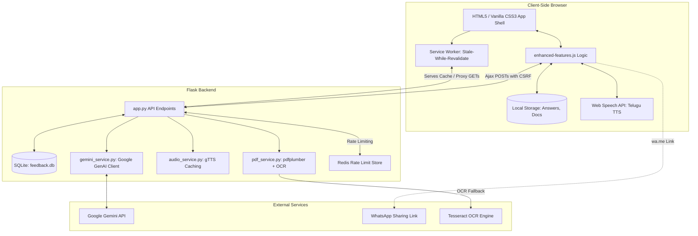
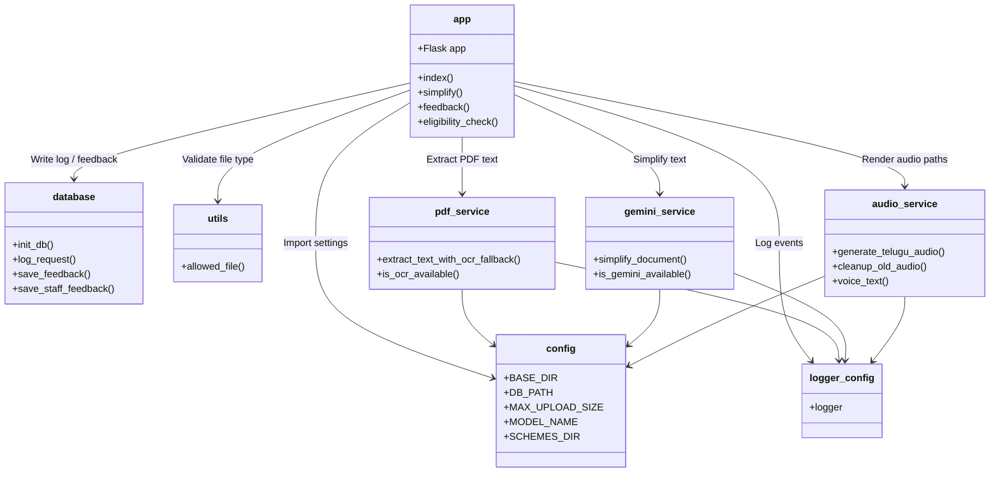
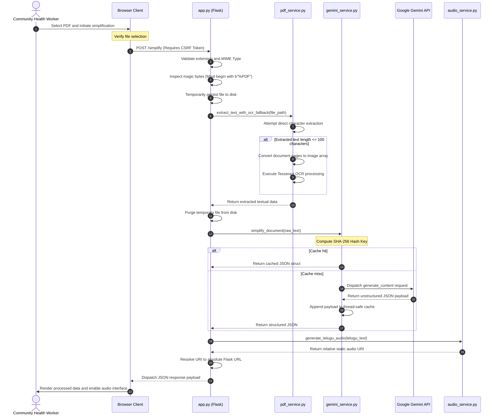
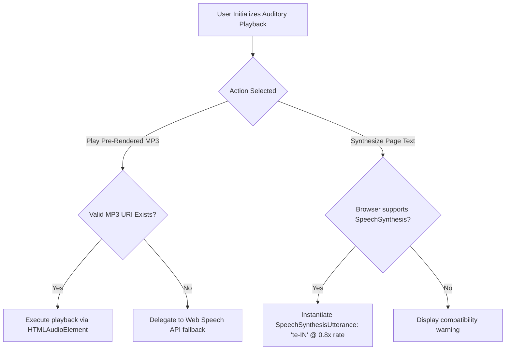
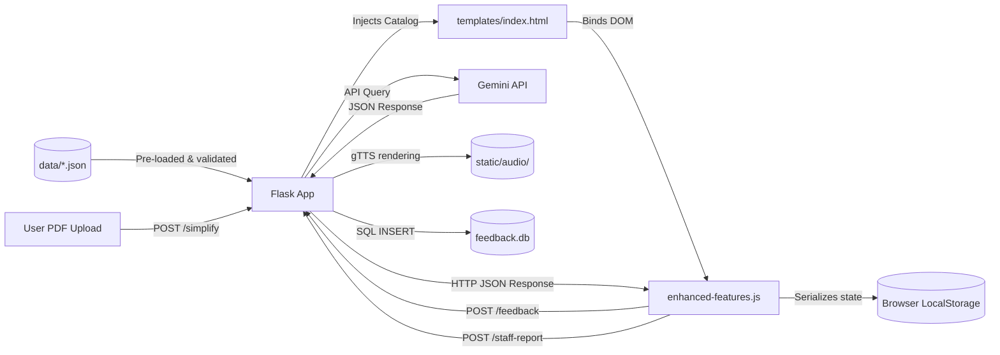

# Codebase Review & Architecture Report: SmartGovAI

## Table of Contents
1. [Project Purpose & Target Audience](#project-purpose--target-audience)
2. [System Architecture](#system-architecture)
3. [Folder Structure & Path Reference](#folder-structure--path-reference)
4. [Key File Explanations & Responsibilities](#key-file-explanations--responsibilities)
5. [Module Relationships & Dependencies](#module-relationships--dependencies)
6. [Detailed Execution Flows](#detailed-execution-flows)
7. [Data Flow Map](#data-flow-map)
8. [Database Schema & Storage Interactions](#database-schema--storage-interactions)
9. [API Reference](#api-reference)
10. [AI & Simplification Engine](#ai--simplification-engine)
11. [External Dependencies](#external-dependencies)
12. [Engineering Assessment & Audit Highlights](#engineering-assessment--audit-highlights)

---

## 1. Project Purpose & Target Audience

**SmartGovAI** is an offline-first Progressive Web Application (PWA) supported by a Python Flask backend. Its primary objective is to democratize access to state and national healthcare welfare schemes for citizens residing in rural Andhra Pradesh, India.

### Key Design Considerations for Low-Literacy & Rural Audiences:
* **Telugu-First Interface:** The default user interface, audio assistance, and search mechanisms prioritize Telugu (the regional language), mitigating literacy barriers.
* **Accessible UI (Touch-Friendly):** All interactive elements exceed the 48px (12mm) physical touch target guidelines established by accessibility standards (ranging from 52px to 56px) and incorporate generous padding to accommodate imprecision during touch interactions.
* **Comprehensive Voice Assistance:** The application integrates a dual-layer audio system. It serves pre-generated high-fidelity MP3s generated via Google Text-to-Speech (gTTS) locally, supplemented by a dynamic client-side `Web Speech API` Telugu text-to-speech fallback, facilitating auditory consumption over reading.
* **Offline-First Resilience:** Engineered to function in geographies with unstable internet connectivity. Static assets and scheme data are persistently cached utilizing Service Workers and the browser's `localStorage` API.
* **Zero-Trust Client Data Storage:** No personally identifiable information (PII), such as Aadhaar credentials, phone numbers, or health cards, is transmitted to or stored on the server. All operational checklists, eligibility assessments, and form inputs are contained strictly within the client's local execution environment via `localStorage`.

---

## 2. System Architecture

SmartGovAI implements a decoupled client-server architecture, enhanced with Progressive Web App features for local data persistence and offline execution.



### Key Architectural Concepts:
1. **Offline PWA Proxy:** The Service Worker intercepts all outgoing GET requests. In the event of network unavailability, it resolves the request immediately by serving assets from the local Cache Storage.
2. **Deterministic Audio Caching:** Pre-rendered audio files are persisted in `static/audio/`. The system queries required files utilizing a SHA-256 hash derived from the targeted Telugu spoken content. External runtime gTTS API calls are executed strictly upon cache misses, conserving bandwidth and minimizing API latency.
3. **Concurrent Request De-duplication:** During concurrent document simplification requests within the AI client layer (`gemini_service.py`), duplicate external requests are intercepted and blocked using thread-level locks and wait events, optimizing API throughput and protecting quota thresholds.
4. **Resilient Rate Limiting:** `Flask-Limiter` is architected to utilize Redis in production environments (via the `REDIS_URL` variable), featuring an automatic and graceful degradation to local memory storage should the Redis instance become unreachable.

---

## 3. Folder Structure & Path Reference

The following delineates the hierarchical file structure of the repository:

```text
SmartGovAI-2026/
├── .env.example                  # Environment variables template
├── Dockerfile                    # Containerization definition
├── docker-compose.yml            # Multi-service container orchestration
├── data/
│   ├── health.json               # Health schemes data catalog
│   └── scheme_schema.json        # Schema validation rules for JSON catalog entries
├── app.py                        # Core Flask application and HTTP routing controller
├── config.py                     # Centralized settings and environment loader
├── database.py                   # SQLite tables, DDL execution, and schema definitions
├── logger_config.py              # Structured logging configuration
├── utils.py                      # Input validation and MIME-type verification
├── requirements.txt              # Python package dependencies
├── pytest.ini                    # Pytest framework configuration
├── docs/
│   └── ENGINEERING_AUDIT.md      # Developer assessment and technical debt audit
├── services/
│   ├── __init__.py
│   ├── audio_service.py          # gTTS wrapper, hash generator, and caching service
│   ├── gemini_service.py         # Google Gemini Client and request de-duplication cache
│   └── pdf_service.py            # PDF text parser (pdfplumber) and Tesseract OCR controller
├── static/
│   ├── audio/                    # Output directory for MP3 voice files
│   ├── enhanced-features.js      # Frontend controller (TTS, storage, event delegation)
│   ├── icon.svg                  # Application brand vector icon
│   ├── manifest.webmanifest      # PWA installation and metadata definitions
│   ├── service-worker.js         # Service worker implementation
│   └── style.css                 # Vanilla CSS, layout grids, and accessibility variables
├── templates/
│   ├── index.html                # Main application UI template (Jinja2)
│   ├── offline.html              # Fallback template for disconnected states
│   └── analytics.html            # Administrative statistics rendering template
├── tests/                        # Automated unit test suite
│   ├── conftest.py               # Shared test fixtures and mock frameworks
│   ├── test_app.py               # API route and response validation tests
│   ├── test_audio_service.py     # Hashing and file generation unit tests
│   ├── test_gemini_service.py    # Request collapsing and caching unit tests
│   ├── test_pdf_service.py       # Document parsing and OCR fallback unit tests
│   └── test_utils.py             # File extension and MIME validation tests
└── scripts/
    ├── QUICKSTART.py             # Developer CLI output guide
    ├── enhance_schemes.py        # Schema expansion script for locational data
    ├── generate_audio.py         # Standalone TTS pre-rendering utility
    └── view_db.py                # Administrative database query script
```

---

## 4. Key File Explanations & Responsibilities

### Core Execution Modules:
* **`app.py`**: Initializes the Flask application context. It binds middleware for performance monitoring, establishes rigorous security headers (`nosniff`, `SAMEORIGIN`, `CSP`, `Referrer-Policy`, `Permissions-Policy`), enforces CSRF protection (`Flask-WTF`), initializes Rate Limiting (`Flask-Limiter`), and controls all API endpoints and HTTP error pages.
* **`config.py`**: Parses the `.env` file via `dotenv`. It exports global application settings, including directory paths (`BASE_DIR`, `UPLOAD_DIR`), operational constraints (`MAX_UPLOAD_SIZE`), AI model configurations, and target locales.
* **`database.py`**: Governs the SQLite database connection using a thread-safe context manager. It manages the execution of Data Definition Language (DDL) statements for all operational tables (`requests`, `feedback`, `whatsapp_shares`, `staff_feedback`) and abstracts the SQL insertion logic.

### Services Layer (Logic):
* **`services/pdf_service.py`**: Manages local document ingestion pipelines. It attempts direct character extraction utilizing `pdfplumber`. If the extracted character count fails to meet the heuristic threshold (indicating a scanned document), the service delegates image rendering to `pdf2image` and conducts Optical Character Recognition (OCR) via `pytesseract` constrained to Telugu and English character sets.
* **`services/gemini_service.py`**: Integrates the `google-genai` SDK. It encapsulates outbound API calls within a thread-safe cache (`OrderedDict`) and a request-collapsing semaphore structure. Concurrent requests querying identical documents block on a `threading.Event()`, ensuring that only a single network request is dispatched and the resulting response is shared across threads.
* **`services/audio_service.py`**: Constructs Telugu voice narratives by concatenating extracted metadata fields. It operates independently of the Flask routing context to permit CLI execution, returns relative asset paths, and executes background storage rotation via `cleanup_old_audio`.

### Frontend Components:
* **`templates/index.html`**: The primary user interface shell. It injects the `schemesCatalog` directly into the Document Object Model (DOM) runtime during template compilation. It establishes interactive bounds for search behaviors (incorporating debouncing) and defines structural containers for dynamically rendered query results.
* **`static/enhanced-features.js`**: Drives all client-side logic. It instantiates the browser's `SpeechSynthesis` API, controls interactive checklist states bounded to `localStorage`, generates shareable text vectors, and monitors network status. It employs event delegation attached to the `#resultArea` to ensure compliance with strict Content Security Policies regarding inline JavaScript execution.
* **`static/service-worker.js`**: Implements the Stale-While-Revalidate network caching strategy. It intercepts browser HTTP fetches, fulfills requests from the local cache instantaneously, dispatches background network validations, and serves `/offline.html` during network disconnections.

---

## 5. Module Relationships & Dependencies



---

## 6. Detailed Execution Flows

### A. Startup Sequence

1. **Environment Setup & Activation:** 
   The administrator provisions a virtual environment and installs documented dependencies located within `requirements.txt`.
2. **Audio Pre-generation (Caching):** 
   The administrator invokes `scripts.generate_audio`. The script parses `data/*.json`, validates entries against the expected schema, and triggers `gTTS` to compile and persist static MP3 artifacts to `static/audio/`.
3. **Web Server Initialization:** 
   The Flask application `app.py` is executed. The initialization sequence invokes `database.init_db()`, instantiates directory paths, loads and sanitizes the JSON metadata catalogs into a unified dictionary structure, verifies external API availability, and binds the WSGI server to the configured network port.

---

### B. PDF Ingestion & AI Simplification Pipeline



---

### C. Voice Synthesis Strategy

The application employs a dual-layer fallback strategy to ensure continuous auditory support:



---

## 7. Data Flow Map



---

## 8. Database Schema & Storage Interactions

The application leverages a local SQLite instance (`feedback.db`) to log transactional metrics, audit trails, and administrative feedback.

### Relational Schemas:

#### 1. `requests`
*Records system lookups for analytics.*
```sql
CREATE TABLE requests (
    id INTEGER PRIMARY KEY AUTOINCREMENT,
    scheme_name TEXT,
    source TEXT,         -- Constraint: 'catalog' or 'pdf'
    timestamp TEXT       -- ISO 8601 UTC representation
);
```

#### 2. `feedback`
*Persists quantitative and qualitative user evaluations.*
```sql
CREATE TABLE feedback (
    id INTEGER PRIMARY KEY AUTOINCREMENT,
    request_id INTEGER,
    rating INTEGER,      -- Integer range 1 to 5
    comment TEXT,
    timestamp TEXT,
    FOREIGN KEY (request_id) REFERENCES requests(id) ON DELETE CASCADE
);
```

#### 3. `eligibility_checks`
*Logs anonymized query parameters for volume analysis.*
```sql
CREATE TABLE eligibility_checks (
    id INTEGER PRIMARY KEY AUTOINCREMENT,
    user_session TEXT,
    scheme_name TEXT,
    answers TEXT,        -- Serialized JSON object
    timestamp TEXT
);
```

#### 4. `document_checklist`
*Persists audit trails of required documentation logic.*
```sql
CREATE TABLE document_checklist (
    id INTEGER PRIMARY KEY AUTOINCREMENT,
    user_session TEXT,
    scheme_name TEXT,
    documents_checked TEXT, -- Serialized JSON array
    timestamp TEXT
);
```

#### 5. `whatsapp_shares`
*Quantifies the frequency of external social distribution.*
```sql
CREATE TABLE whatsapp_shares (
    id INTEGER PRIMARY KEY AUTOINCREMENT,
    scheme_name TEXT,
    timestamp TEXT
);
```

#### 6. `staff_feedback`
*Collects administrative error reports from field personnel.*
```sql
CREATE TABLE staff_feedback (
    id INTEGER PRIMARY KEY AUTOINCREMENT,
    scheme_name TEXT,
    village TEXT,
    feedback_text TEXT,
    issue_type TEXT,
    timestamp TEXT
);
```

---

## 9. API Reference

System communication is exclusively mediated via the following HTTP/JSON endpoints:

| Endpoint | Method | Input Parameters | Output Format | Description |
| :--- | :--- | :--- | :--- | :--- |
| `/` | `GET` | Query params | HTML | Serves the primary application shell. |
| `/offline.html` | `GET` | None | HTML | Static fallback template served by the Service Worker during network isolation. |
| `/healthz` | `GET` | None | JSON | Returns system telemetry, catalog volume metrics, and disk write permissions. |
| `/simplify` | `POST` | `multipart/form-data` OR JSON `{"scheme_name": "..."}` | JSON | Executes PDF text extraction, AI simplification, and returns localized JSON nodes. Rate limited. |
| `/eligibility-check` | `POST` | JSON: `{"scheme_name": "...", "answers": {}}` | JSON | Evaluates conditional eligibility logic against user inputs. |
| `/document-checklist` | `GET` | Query param `?scheme_name=...` | JSON | Retrieves hierarchical documentation requirements. |
| `/whatsapp-share` | `POST` | JSON: `{"scheme_name": "..."}` | JSON | Compiles a formatted URI string for external WhatsApp integration. CSRF protected. |
| `/enhanced-feedback` | `POST` | JSON: `{"request_id": 1, "rating": 5}` | JSON | Inserts qualitative and quantitative user assessments. CSRF and Rate Limit protected. |
| `/staff-report` | `POST` | JSON: `{"scheme_name": "...", "feedback_text": "..."}` | JSON | Submits administrative discrepancy alerts. CSRF and Rate Limit protected. |
| `/local-locations` | `GET` | Query params `?scheme_name=...` | JSON | Resolves and returns localized geographical points of interest. |
| `/offline-cache` | `GET` | None | JSON | Returns the comprehensive scheme dictionary for client-side persistence mechanisms. |

---

## 10. AI & Simplification Engine

The intelligence layer utilizes the Google Gemini API to distill complex governmental jargon into accessible prose.

### System Prompt Engineering:
```text
You simplify Indian government health scheme documents for rural Andhra Pradesh citizens.

Scheme/document name: {scheme_name}
Text:
"""{complex_text}"""

Return simple, accurate information. Do not invent benefits that are not present in the text.
Use easy English, then translate to clear Telugu.

Return strictly this JSON object:
{
    "simplified": {
        "eligibility": "Who can apply?",
        "benefits": "What do they get?",
        "documents": "What documents are needed?",
        "steps": "How to apply step by step?"
    },
    "telugu": {
        "eligibility": "Telugu translation of eligibility",
        "benefits": "Telugu translation of benefits",
        "documents": "Telugu translation of documents",
        "steps": "Telugu translation of steps"
    }
}
```

### Safety & Generative Guardrails:
1. **JSON Enforcement:** Utilizes `response_mime_type="application/json"` to guarantee structured parsable outputs.
2. **Temperature Constraints:** Set rigidly to `0.2` to constrain model variance and minimize hallucination vectors.
3. **Network Thresholds:** A `15.0` second network timeout prevents synchronous thread exhaustion.
4. **Resilient Failure:** The absence of `GEMINI_API_KEY` triggers a graceful degradation where document ingestion is disabled while preserving catalog functionality.

---

## 11. External Dependencies

| Package | Classification | Technical Function |
| :--- | :--- | :--- |
| **Flask** | Framework | Manages WSGI routing, HTTP lifecycle, and Jinja2 template rendering. |
| **google-genai** | API Client | Facilitates authenticated communication with Gemini LLM endpoints. |
| **pdfplumber** | Parser | Extracts structured character representations from standard PDF binaries. |
| **pdf2image** | Converter | Transforms embedded PDF pages into rasterized image arrays for OCR preprocessing. |
| **pytesseract** | OCR Engine | Analyzes image pixel data to extract Unicode characters (`tel+eng`). |
| **gTTS** | Audio Client | Interacts with Google TTS servers to generate MP3 streams. |
| **python-dotenv** | Environment | Ingests and parses `.env` configurations. |
| **Flask-WTF** | Security | Enforces strict CSRF token validation on mutable endpoints. |
| **Flask-Limiter** | Security | Implements sliding-window request throttling backed by Redis or Memory. |
| **sqlite3** | Database | Embedded relational database driver. |
| **pytest** | Quality Assurance | Executes unit test suites and validates integration logic. |

---

## 12. Engineering Assessment & Audit Highlights

Based on the internal engineering audit (`docs/ENGINEERING_AUDIT.md`), the following represents the architectural evaluation of the current codebase:

### Technical Strengths:
* **Robust Test Coverage:** The implementation maintains an 86% test coverage ratio validated through automated mock integration.
* **Algorithmic Caching:** Significant reduction in external API reliance via deterministic cache hashing, improving median response times.
* **Security Hygiene:** Comprehensive application of CSRF middleware, debounced interface bindings, secure event delegation, and rigorous binary signature validations.

### Identified Technical Debt & Roadmap:
* **Monolithic Controller Logic:** The primary `app.py` module governs routing, logic invocation, and error formatting. Refactoring into discrete Flask Blueprints (e.g., `api.py`, `views.py`) will enhance structural maintainability.
* **Synchronous Execution Blockers:** Both AI and TTS processing are implemented synchronously, which blocks the active WSGI worker thread. Migrating these pipelines to an asynchronous task queue architecture (e.g., Celery) is recommended for scalable deployment.
* **Exception Granularity:** Current exception catching blocks within the processing layers lack specificity. Transitioning to explicit exception classes (e.g., `GenAPIError`, `PDFSyntaxError`) will improve observability and alerting precision.
