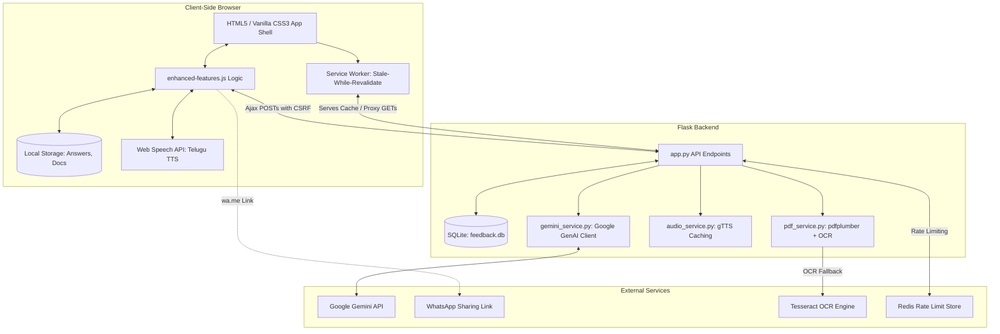

# SmartGovAI — SmartGov Health

[](https://github.com/giridharreddy-dev/SmartGovAI-2026/actions/workflows/pytest.yml)
[](https://github.com/giridharreddy-dev/SmartGovAI-2026)
[](https://github.com/giridharreddy-dev/SmartGovAI-2026)
[](https://www.python.org/downloads/)
[](https://github.com/giridharreddy-dev/SmartGovAI-2026)

**SmartGov Health** is an offline-first Progressive Web App (PWA) with a Python Flask backend designed to bridge the digital divide. It empowers low-literacy citizens in rural Andhra Pradesh to discover, check eligibility for, and understand government health and welfare schemes in an accessible, language-first way.

The application couples a Telugu-first touch-accessible user experience with optional AI-assisted PDF document simplification, deterministic audio pre-caching, and client-side persistence for a robust, public-service grade experience.

---

## 📖 Table of Contents
* [System Architecture](#-system-architecture)
* [Folder Structure](#-folder-structure)
* [How Schemes Are Loaded](#-how-schemes-are-loaded)
* [How to Add a New Scheme](#-how-to-add-a-new-scheme)
* [How to Add a New Category](#-how-to-add-a-new-category)
* [How to Regenerate Audio](#-how-to-regenerate-audio)
* [Environment Variables](#-environment-variables)
* [Rate Limiting Configuration](#-rate-limiting-configuration)
* [Security Features](#-security-features)
* [Validation Process](#-validation-process)
* [Installation & Setup](#-installation--setup)
* [Testing](#-testing)
* [API Documentation](#-api-documentation)
* [License](#-license)

---

## 🏗️ System Architecture

SmartGov Health follows a classic decoupled client-server architecture, reinforced with Progressive Web App features for local persistence and offline operations.



For a deeper dive into the file relationships, database schemas, and execution flowcharts, refer to:
👉 **[CODEBASE_REVIEW.md](file:///c:/Users/HP/OneDrive/Desktop/SmartGovAI-2026/CODEBASE_REVIEW.md)**

---

## 📁 Folder Structure

Below is the file layout of the repository:

```
SmartGovAI-2026/
├── data/
│   ├── health.json               # Categorized health scheme data catalog
│   └── scheme_schema.json        # JSON Schema documenting catalog structures
├── docs/
│   └── ENGINEERING_AUDIT.md      # High-level assessment & technical debt audit
├── services/
│   ├── __init__.py
│   ├── audio_service.py          # gTTS wrapper, audio hash generator, and cleanup (Flask-independent)
│   ├── gemini_service.py         # Google Gemini Client, request de-duplication, thread-safe cache
│   └── pdf_service.py            # PDF parser (pdfplumber) with Tesseract OCR fallback
├── static/
│   ├── audio/                    # Directory for generated or pre-cached MP3 voice files
│   ├── enhanced-features.js      # Frontend controller (TTS, checklists, storage, reports, event delegation)
│   ├── icon.svg                  # Application brand icon
│   ├── manifest.webmanifest      # PWA installation details
│   ├── service-worker.js         # Service worker file caching and pre-caching mechanism
│   └── style.css                 # Vanilla CSS, grid variables, dynamic layouts, button sizes
├── templates/
│   ├── index.html                # Main application UI template (Jinja2, inline-script debounced)
│   ├── offline.html              # Fallback page when client is completely disconnected
│   └── analytics.html            # Admin feedback stats rendering template
├── tests/                        # Pytest unit tests
│   ├── conftest.py               # Shared test fixtures (mock files, dummy testing env)
│   ├── test_app.py               # API route, response structure, and validation unit tests
│   ├── test_audio_service.py     # Hashing and file generation unit tests
│   ├── test_gemini_service.py    # Request collapsing and caching unit tests
│   ├── test_pdf_service.py       # Plumber parsing & OCR fallback unit tests
│   └── test_utils.py             # File extension, mimetype validation tests
├── scripts/
│   ├── QUICKSTART.py             # Help/FAQ developer CLI printout
│   ├── enhance_schemes.py        # Populates data/health.json with questions & locations
│   ├── generate_audio.py         # Standalone utility to pre-render Telugu voice MP3 files
│   └── view_db.py                # Admin helper script to query SQLite requests/feedback
├── app.py                        # Core Flask application, routing, CSRF/Limiter, and HTTP pipeline
├── config.py                     # Centralized settings and environment loader
├── database.py                   # SQLite tables, helper functions, and schema definition
├── logger_config.py              # Structured logging basic config
├── utils.py                      # Input/file upload validation functions
├── requirements.txt              # Primary project dependencies
└── pytest.ini                    # Pytest framework configuration settings
```

---

## 🗃️ How Schemes Are Loaded

SmartGov Health supports **modular scheme loading**. During application startup:
1. The server scans the `data/` directory.
2. It attempts to load and parse every file ending in `.json` (ignoring `scheme_schema.json`).
3. Each loaded scheme entry is validated against structural schema constraints (e.g. checks that categories, Telugu text, original complex strings, and checklist fields exist).
4. Valid schemes are merged into a single in-memory dictionary catalog, making them instantly available to the client.

---

## ➕ How to Add a New Scheme

To add a new scheme to an existing category file (e.g. `data/health.json`):
1. Open the JSON file in your editor.
2. Append a new key representing the scheme name.
3. Define the required fields matching the structure of the schema:
```json
  "My New Scheme Name": {
    "level": "Andhra Pradesh",
    "category": "Hospital treatment",
    "icon": "hospital",
    "telugu_name": "నా కొత్త పథకం పేరు",
    "audio_file": "static/audio/my_new_scheme.mp3",
    "original_complex_text": "Full legal detailed text of the policy...",
    "simplified": {
      "eligibility": "Simple eligibility criteria in English.",
      "benefits": "Simple benefits description.",
      "documents": "Required documents list.",
      "steps": "Step-by-step application instructions."
    },
    "telugu": {
      "eligibility": "సరళమైన అర్హత వివరాలు తెలుగులో.",
      "benefits": "ప్రయోజనాలు తెలుగులో.",
      "documents": "కావలసిన పత్రాలు.",
      "steps": "అప్లై చేసుకునే విధానం."
    },
    "last_updated": "2026-07-17",
    "official_website": "https://example.gov.in/",
    "contact_office": "Local Department Office",
    "eligibility_confirmation": "Help Desk / ANM",
    "eligibility_questions": [
      {
        "question_te": "మీరు అర్హులేనా?",
        "question_en": "Are you eligible?",
        "weight": "high"
      }
    ],
    "required_documents": [
      {
        "name": "Aadhaar Card",
        "name_te": "ఆధార్ కార్డు",
        "optional": false
      }
    ],
    "local_help_locations": {
      "contact": "Local Help Desk"
    }
  }
```

---

## 📁 How to Add a New Category

To add a completely new category (e.g., Education, Agriculture, Pensions):
1. Create a new JSON file inside the `data/` directory (e.g. `data/education.json`).
2. Add your scheme definitions inside this JSON file following the standard scheme structure.
3. Restart the Flask application. The server will scan the `data/` directory, load the file, validate the schemes, and merge them into the active catalog automatically. No code changes are required.

---

## 🔊 How to Regenerate Audio

To pre-render audio MP3 assets for all schemes (including new categories/files added to the `data/` folder):
1. Activate your virtual environment:
   ```bash
   .\.venv\Scripts\activate
   ```
2. Run the audio generation script:
   ```bash
   python -m scripts.generate_audio
   ```
This script automatically:
* Scans the `data/` directory to load all active schemes.
* Checks if an MP3 file already exists at the configured path (`static/audio/...`).
* Only calls Google Text-to-Speech (gTTS) to compile audio when the file is missing or regeneration is necessary.
* Saves the resulting files locally, ensuring the app is immediately offline-ready.

---

## 🔑 Environment Variables

Configure parameters by adding them to your local `.env` file:

```bash
# Flask Session Encryption Key (Required in production)
SECRET_KEY=your-production-secret-key-here

# Optional: Google Gemini API Key (Enables PDF simplification upload feature)
GEMINI_API_KEY=AIzaSy...

# Optional: SQLite Database Path (Defaults to feedback.db)
DB_PATH=feedback.db

# Optional: Redis URL for Rate Limit Storage (Uses memory:// if missing or unreachable)
REDIS_URL=redis://localhost:6379

# Configure API Rate limits
RATELIMIT_DEFAULT="200 per day; 50 per hour"
RATELIMIT_SIMPLIFY="10 per minute; 60 per hour"
RATELIMIT_FEEDBACK="20 per minute"
RATELIMIT_REPORT="10 per minute"
```

---

## 🚦 Rate Limiting Configuration

The rate limiting engine (`Flask-Limiter`) is designed for high-availability deployments:
* **Development:** Operates fully in-memory (`memory://`) by default.
* **Production:** Automatically connects to Redis if the `REDIS_URL` environment variable is defined.
* **Graceful Fallback:** If the Redis server experiences connectivity errors or is unreachable, the system automatically falls back to in-memory tracking, ensuring uninterrupted client availability.
* Rate limits are fully configurable on a per-route basis using environment variables.

---

## 🔒 Security Features

SmartGov Health includes enterprise-grade security hardening:
1. **CSRF Protection (`Flask-WTF`):** All state-changing POST endpoints (`/simplify`, `/feedback`, `/enhanced-feedback`, `/staff-report`, `/whatsapp-share`) require anti-forgery tokens. Tokens are embedded in HTML meta tags and attached under the header `X-CSRFToken` in all client AJAX requests.
2. **CSP (Content Security Policy):** Headers enforce script execution rules. Inline JS event attributes (`onclick`, `onchange`) have been completely removed. Dynamic elements instead use `data-*` attributes and event delegation.
3. **Strict HTTP Headers:** Sends protective headers:
   * `X-Content-Type-Options: nosniff` (prevents MIME sniffing)
   * `X-Frame-Options: SAMEORIGIN` (prevents clickjacking)
   * `Referrer-Policy: strict-origin-when-cross-origin`
   * `Permissions-Policy: geolocation=(), microphone=()`
4. **Safe File Uploads:** Uploaded PDFs are validated in multiple layers (file extensions, mimetype checking, and verification of magic bytes starting with `b"%PDF"`).

---

## 📊 Validation Process

SmartGov Health guarantees catalog integrity using a schema validation engine:
* **Schema Conformance:** During application startup, every loaded scheme is validated to confirm that required fields exist and correspond to expected types.
* **Resilient Startup:** If a scheme is invalid or has a malformed structure, the loader prints/logs a detailed warning, skips **only** that specific entry, and continues loading remaining schemes. The application will never crash on boot due to a single malformed entry.

---

## 🚀 Installation & Setup

### Prerequisites
* Python 3.10+ (Python 3.14 verified)
* Pip & Virtualenv
* *Optional:* Tesseract-OCR and Poppler binaries installed on your system path.

### 1. Setup Environment
```bash
git clone https://github.com/giridharreddy-dev/SmartGovAI-2026.git
cd SmartGovAI-2026
python -m venv .venv
.\.venv\Scripts\activate       # Windows PowerShell
pip install -r requirements.txt
```

### 2. Pre-generate Audio & Run
```bash
# Generate audio files
python -m scripts.generate_audio

# Start the Flask app
python app.py
```
Open `http://localhost:5000` to interact with the application.

---

## 🧪 Testing

Run the automated test suite with pytest:
```bash
pytest
```
*Current test statistics: 29 unit tests passing, achieving **86% code coverage**.*