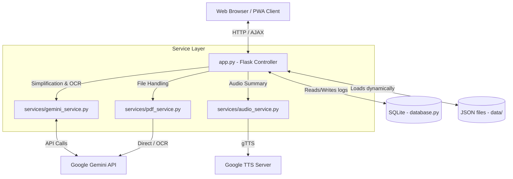

# SmartGov Health: Codebase & Architecture Review

This document provides a comprehensive analysis of the SmartGov Health codebase, detailing its purpose, technologies, directory structure, components, and overall architecture.

---

## 1. Project Purpose

**SmartGov Health** is a high-accessibility, offline-capable welfare scheme discovery and simplification portal tailored for citizens of Andhra Pradesh, India. It is specifically designed to accommodate:
* Rural citizens
* Elderly users
* First-time smartphone users

By translating complex government policy documents into plain, direct, and simplified summaries (in both Telugu and English), it empowers citizens to understand their eligibility, benefits, and application steps. The application also provides offline caching, voice search, and automated Text-to-Speech (TTS) voice guides in Telugu to bypass literacy barriers.

---

## 2. Technologies Used

The codebase is built on a modern, lightweight, and secure stack:

* **Backend Framework**: Python 3.x with **Flask**.
* **Database & Persistence**: **SQLite** (via standard library `sqlite3`) for audit logs, client requests, and feedback collection.
* **Artificial Intelligence (AI)**: **Google Gemini API** (using the `google-genai` SDK) for OCR text extraction, policy document simplification, translation, and structured data generation.
* **Text-To-Speech (TTS)**: **gTTS (Google Text-to-Speech)** to pre-render and cache Telugu audio guides.
* **Rate Limiting**: **Flask-Limiter** configured with a **Redis** production backend (automatically falling back to local memory if Redis is unavailable).
* **Security Middleware**: **Flask-WTF** for CSRF token protection on AJAX endpoints.
* **Frontend Layer**: 
  * **Markup**: Semantic HTML5 with Jinja2 templating.
  * **Styles**: Vanilla CSS3 optimized for touch controls, readable font scaling, and high contrast.
  * **Scripts**: ES6+ JavaScript utilizing **Event Delegation** (to remain Content-Security-Policy compliant) and Service Workers for Progressive Web App (PWA) offline caching.
* **Testing**: **Pytest** with coverage tools (`pytest-cov`) and mocks.

---

## 3. Directory Structure

```
SmartGovAI-2026/
├── .env.example
├── Dockerfile
├── docker-compose.yml
├── requirements.txt
├── app.py                      # Flask Application entry point & routes
├── database.py                 # SQLite database setup and helper actions
├── config.py                   # Environment configuration loader
├── utils.py                    # File verification & MIME-type checks
├── logger_config.py            # Logger initialization
├── data/                       # Welfare schemes & JSON schemas
│   ├── scheme_schema.json      # JSON Schema for database entries
│   ├── health.json             # Core health schemes catalog
│   ├── national_and_ap_schemes.json
│   └── extra_schemes.json
├── services/                   # Business logic layer
│   ├── audio_service.py        # TTS audio generator
│   ├── gemini_service.py       # Gemini API wrapper for simplification
│   └── pdf_service.py          # PDF parser & Gemini-based OCR
├── static/                     # Public web assets
│   ├── style.css               # Main styling stylesheet
│   ├── enhanced-features.js    # Client-side UI & event handlers
│   ├── service-worker.js       # PWA offline cache controller
│   ├── manifest.webmanifest    # PWA configuration
│   ├── icon.svg                # Web app brand icon
│   └── audio/                  # Pre-rendered MP3 voice clips cache
├── templates/                  # Jinja2 views
│   └── index.html              # Main application web interface
├── tests/                      # Automated test suite
│   ├── test_app.py
│   ├── test_audio_service.py
│   ├── test_gemini_service.py
│   ├── test_pdf_service.py
│   └── test_utils.py
├── uploads/                    # Temporary folder for PDF uploads
└── scripts/                    # Development/Ops helper scripts
    └── generate_audio.py       # Offline bulk TTS generation script
```

---

## 4. Role of Each Major Folder

### 📂 `data/`
Acts as the static database for health schemes. Individual schemes are stored as structured JSON entries containing metadata, Telugu translation strings, keywords, eligibility check questions, and document checklists. All files are checked against `scheme_schema.json` to ensure consistency.

### 📂 `services/`
Separates the core business logic from the HTTP request-response cycle in the Flask controller:
* **`gemini_service.py`**: Interacts with the Gemini model to parse, translate, and structure complex policies.
* **`pdf_service.py`**: Extracts text from PDF files. If the PDF is scanned or image-heavy, it automatically delegates to Gemini for visual OCR.
* **`audio_service.py`**: Converts summary text to Telugu speech MP3 files saved under the static asset directory.

### 📂 `static/`
Contains public-facing assets served directly to the browser. Contains `enhanced-features.js` (responsible for PWA installation, offline checking, eligibility answers caching in localStorage, and event delegation) and `style.css` (defines accessible visual components like large targets and high-contrast headings).

### 📂 `templates/`
Holds the Jinja2 templates. `index.html` renders the application shell. It utilizes backend data to dynamically build the search index and populate the dropdown menu.

### 📂 `tests/`
Houses all unit and integration tests. Tests mock external service calls (like Gemini and gTTS network requests) to guarantee high test reliability and fast execution times.

---

## 5. Application Overall Architecture

The application implements a decoupled, secure **Model-View-Controller (MVC)** inspired architecture:



1. **Routing and Security Middleware**:
   * All incoming HTTP requests hit `app.py`.
   * Security middleware checks the global rate limit (via Flask-Limiter) and validates CSRF tokens (via Flask-WTF) on POST requests.
2. **Dynamic Data Processing**:
   * On startup, the Flask controller dynamically scans and parses all JSON files in the `data/` folder, compiling them into a unified catalog dictionary.
   * This dictionary is passed to `templates/index.html` to render the dropdown options, which ensures the dropdown grows dynamically whenever new data files are added.
3. **Decoupled Service Interactions**:
   * If a user requests a scheme summary or uploads a PDF, the controller delegates the task to the appropriate service module (`gemini_service.py`, `pdf_service.py`, or `audio_service.py`).
   * Services are written to run independently of the Flask request context, facilitating unit testing and command-line execution (e.g., bulk pre-generating audio files).
4. **Client-Side Rendering & Caching**:
   * The web page operates as a Single-Page Application (SPA).
   * Once a scheme is requested, the details are fetched asynchronously via JSON AJAX endpoints.
   * The results are rendered dynamically in `#resultArea`, while `service-worker.js` intercepts and caches requests to allow offline navigation.
5. **Audit Logging & Feedback**:
   * User feedback ratings, simplification requests, and system errors are logged asynchronously to the local SQLite database for operations auditing.
