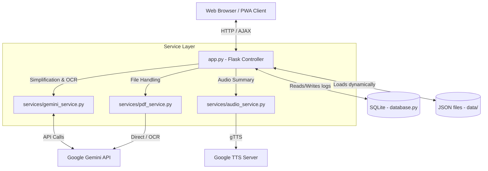

# SmartGovAI: Codebase and Architecture Review

## Table of Contents
1. [Project Purpose](#project-purpose)
2. [Technologies Utilized](#technologies-utilized)
3. [Directory Structure](#directory-structure)
4. [Role of Major Directories](#role-of-major-directories)
5. [Overall Application Architecture](#overall-application-architecture)

---

## 1. Project Purpose

**SmartGovAI** operates as a high-accessibility, offline-capable welfare scheme discovery and simplification portal tailored for citizens of Andhra Pradesh, India. It is specifically engineered to accommodate:
* Rural citizens
* Elderly demographics
* First-time smartphone users

By translating complex governmental policy documents into direct, simplified summaries (in both Telugu and English), the application empowers citizens to comprehend their eligibility requirements, benefits, and application procedures. The system mitigates literacy barriers by providing offline caching, voice-based search functionalities, and automated Text-to-Speech (TTS) auditory guides in Telugu.

---

## 2. Technologies Utilized

The codebase is engineered upon a modern, lightweight, and secure software stack:

* **Backend Framework**: Python 3.x utilizing **Flask**.
* **Database and Persistence**: **SQLite** (via the standard library `sqlite3`) for audit logs, client request tracking, and feedback aggregation.
* **Artificial Intelligence (AI)**: **Google Gemini API** (via the `google-genai` SDK) for Optical Character Recognition (OCR) text extraction, policy document simplification, translation, and structured data generation.
* **Text-To-Speech (TTS)**: **gTTS (Google Text-to-Speech)** to pre-render and locally cache Telugu audio files.
* **Rate Limiting**: **Flask-Limiter** configured with a **Redis** production backend (incorporating an automatic degradation to local memory if the Redis instance is unavailable).
* **Security Middleware**: **Flask-WTF** for Cross-Site Request Forgery (CSRF) token validation on asynchronous endpoints.
* **Frontend Layer**: 
  * **Markup**: Semantic HTML5 integrated with Jinja2 templating.
  * **Styles**: Vanilla CSS3 optimized for touch interactions, readable font scaling, and high-contrast rendering.
  * **Scripts**: ES6+ JavaScript utilizing **Event Delegation** (to enforce Content-Security-Policy compliance) and Service Workers to facilitate Progressive Web App (PWA) offline caching capabilities.
* **Testing**: **Pytest** supplemented by coverage measurement tools (`pytest-cov`) and isolated mocking frameworks.

---

## 3. Directory Structure

```text
SmartGovAI-2026/
├── .env.example
├── Dockerfile
├── docker-compose.yml
├── requirements.txt
├── app.py                      # Flask Application entry point and routing controller
├── database.py                 # SQLite database initialization and helper abstractions
├── config.py                   # Environment configuration loader
├── utils.py                    # File verification and MIME-type validation
├── logger_config.py            # Logger initialization protocol
├── data/                       # Welfare schemes and JSON schema definitions
│   ├── scheme_schema.json      # JSON Schema for database entries
│   ├── health.json             # Core health schemes catalog
│   ├── national_and_ap_schemes.json
│   └── extra_schemes.json
├── services/                   # Business logic layer
│   ├── audio_service.py        # TTS audio generator
│   ├── gemini_service.py       # Gemini API wrapper for simplification logic
│   └── pdf_service.py          # PDF parser and Gemini-based OCR controller
├── static/                     # Public web assets
│   ├── style.css               # Main presentation stylesheet
│   ├── enhanced-features.js    # Client-side UI and event handlers
│   ├── service-worker.js       # PWA offline cache controller
│   ├── manifest.webmanifest    # PWA configuration properties
│   ├── icon.svg                # Web app brand vector
│   └── audio/                  # Pre-rendered MP3 voice clips cache directory
├── templates/                  # Jinja2 view templates
│   └── index.html              # Main application web interface
├── tests/                      # Automated test suite
│   ├── test_app.py
│   ├── test_audio_service.py
│   ├── test_gemini_service.py
│   ├── test_pdf_service.py
│   └── test_utils.py
├── uploads/                    # Temporary directory for PDF uploads
└── scripts/                    # Development and Operations helper scripts
    └── generate_audio.py       # Offline bulk TTS generation script
```

---

## 4. Role of Major Directories

### `data/`
Functions as the static database for health schemes. Individual schemes are stored as structured JSON entries containing metadata, Telugu translation strings, keywords, eligibility interrogatives, and document checklists. All files are evaluated against `scheme_schema.json` to enforce structural consistency prior to loading.

### `services/`
Separates the core business logic from the HTTP request-response cycle managed within the Flask controller:
* **`gemini_service.py`**: Interacts with the Gemini language models to parse, translate, and structure complex policies into readable formats.
* **`pdf_service.py`**: Extracts text from PDF binaries. If the PDF utilizes a scanned or image-heavy format, it automatically delegates processing to the Gemini vision models for optical character recognition.
* **`audio_service.py`**: Converts summary text to Telugu speech MP3 files, persisting them within the static asset directory for offline retrieval.

### `static/`
Contains public-facing assets served directly to the client browser. This includes `enhanced-features.js` (responsible for PWA installation, offline state management, eligibility answers caching in `localStorage`, and event delegation) and `style.css` (which defines accessible visual components such as large physical touch targets and high-contrast typography).

### `templates/`
Houses the Jinja2 templates. `index.html` renders the application shell. It utilizes backend data payloads to dynamically construct the search index and populate the dropdown menu.

### `tests/`
Contains all unit and integration tests. Test modules explicitly mock external service calls (e.g., Gemini API and gTTS network requests) to guarantee high test reliability, environment independence, and rapid execution times.

---

## 5. Overall Application Architecture

The application implements a decoupled, secure **Model-View-Controller (MVC)** architectural pattern:



1. **Routing and Security Middleware**:
   * All inbound HTTP requests are intercepted by `app.py`.
   * Security middleware evaluates the global rate limit (via Flask-Limiter) and validates CSRF tokens (via Flask-WTF) on state-mutating POST requests.
2. **Dynamic Data Processing**:
   * Upon initialization, the Flask controller dynamically scans and parses all JSON files within the `data/` directory, compiling valid entries into a unified dictionary catalog.
   * This dictionary is transmitted to `templates/index.html` to render interactive components, ensuring the interface remains synchronized with the underlying data files automatically.
3. **Decoupled Service Interactions**:
   * When a user requests a scheme summary or uploads a PDF document, the controller delegates the computational task to the appropriate service module (`gemini_service.py`, `pdf_service.py`, or `audio_service.py`).
   * Services are decoupled from the Flask request context, facilitating isolated unit testing and command-line execution.
4. **Client-Side Rendering and Caching**:
   * The web interface operates as a Single-Page Application (SPA).
   * Once a scheme is queried, the specific details are fetched asynchronously via JSON AJAX endpoints.
   * The DOM is updated dynamically, while `service-worker.js` intercepts and caches network requests to permit persistent offline navigation.
5. **Audit Logging and Feedback**:
   * Quantitative user ratings, document simplification requests, and system-level exceptions are logged asynchronously to the local SQLite database to facilitate continuous operations auditing.
