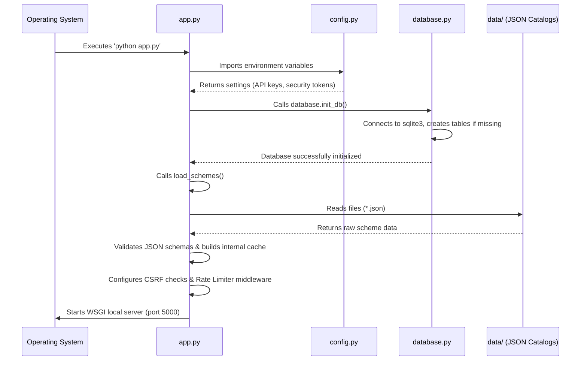
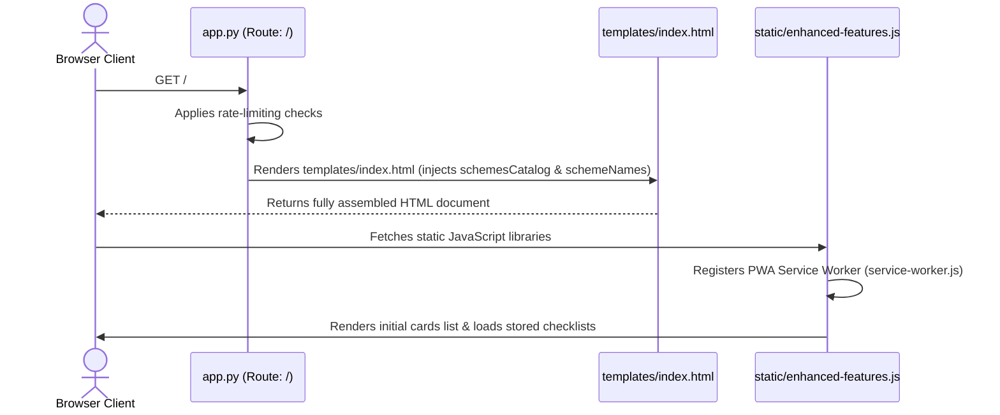
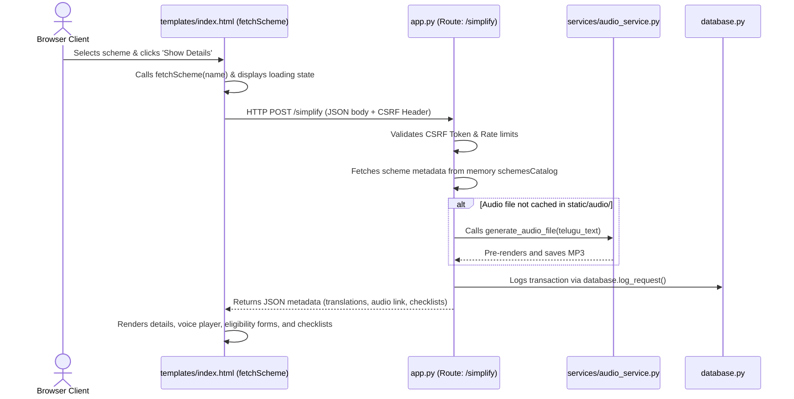
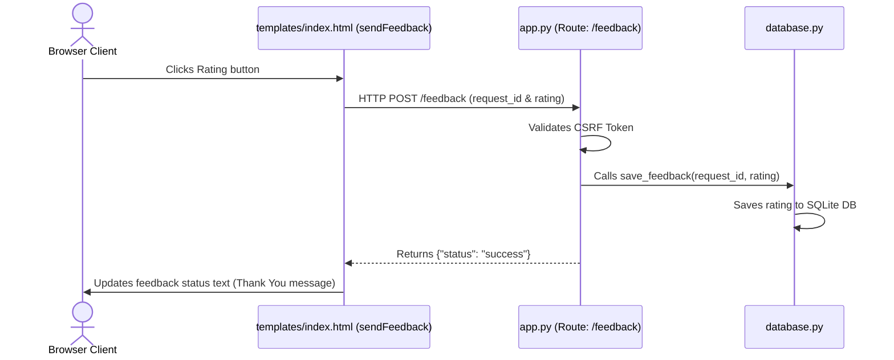

# SmartGov Health: Execution Flow Dictionary

This document details the step-by-step execution flow of the SmartGov Health application, starting from server startup through to a user executing a health scheme lookup and submitting feedback.

---

## 🚀 Step 1: Application Launch (Startup Sequence)

When the administrator launches the application (e.g., via `python app.py` or running `start_app.bat`), the execution proceeds as follows:

1. **Environment Setup**:
   * **`app.py`** loads and imports external libraries (Flask, Flask-WTF, Flask-Limiter, etc.).
   * **`config.py`** is parsed to extract API keys, Secret keys, and Redis database connections.
2. **Database Verification**:
   * **`app.py`** calls `init_db()` from **`database.py`**.
   * `init_db()` connects to the local SQLite file `feedback.db` and runs DDL statements to verify and establish the `requests`, `feedback`, and `audit_logs` tables.
3. **Data Loading**:
   * **`app.py`** calls `load_schemes()`.
   * It scans the **`data/`** directory, loading every `.json` file (excluding schemas).
   * It validates each scheme definition against `scheme_schema.json`.
   * It merges all entries into a unified, in-memory global catalog called `schemesCatalog` and extracts its keys to a list called `schemeNames`.
4. **Middleware Binding**:
   * Configures `Flask-Limiter` (with Redis if active, or falling back to local memory storage).
   * Binds CSRF protection headers through `CSRFProtect(app)`.
   * Bootstraps the local WSGI server listening on port `5000`.

---

## 🖥️ Step 2: Client Access (Page Load)

When a citizen navigates to the application URL in their browser:

1. **Route Matching**:
   * The request triggers the `@app.route('/')` mapping, executing the `index()` function.
2. **Template Compilation**:
   * `index()` queries the rate limiter to verify the user has not exceeded access thresholds.
   * Renders **`templates/index.html`**, passing `schemesCatalog` and `schemeNames` as context parameters.
   * Jinja2 compiles the templates: serializing the scheme list as JSON inside script tags, and rendering the dropdown options alphabetically.
3. **Frontend Initializations**:
   * The client browser receives the raw HTML document and requests associated static assets like [static/style.css](file:///c:/Users/HP/OneDrive/Desktop/SmartGovAI-2026/static/style.css) and [static/enhanced-features.js](file:///c:/Users/HP/OneDrive/Desktop/SmartGovAI-2026/static/enhanced-features.js).
   * **`static/enhanced-features.js`** registers **`static/service-worker.js`** for offline caching.
   * It reads `localStorage` to restore any saved document checklists or answers.
   * Renders the initial lists of scheme cards on screen via `renderSchemeCards()`.

---

## 🔍 Step 3: User Search or Dropdown Selection (Scheme Request)

When a user clicks a scheme card or selects an option from the dropdown menu and clicks `"వివరాలు చూపించు"`:

1. **Client Trigger**:
   * Clicking a card or selecting an item calls `fetchScheme(schemeName)` inside **`templates/index.html`**.
   * It alters the page state to show a loading spinner.
   * It sends an asynchronous `POST` fetch request to `/simplify` passing the `scheme_name` in JSON and forwarding the CSRF token in the `X-CSRFToken` request header.
2. **Controller Handling**:
   * **`app.py`** intercepts the request at `/simplify`.
   * CSRF protection validates the header token against the session hash.
   * The controller verifies the scheme name exists in the local `schemesCatalog`.
3. **Audio Pre-Check**:
   * The controller parses the scheme's Telugu description text.
   * It computes a safe, sanitized filename for the TTS audio file.
   * If the file does not exist in `static/audio/`, it calls `generate_audio_file()` from **`services/audio_service.py`**, which contacts Google TTS servers to render and save the Telugu speech MP3 locally.
4. **Audit Logging**:
   * The controller calls `log_request()` in **`database.py`** to insert request details into the database.
5. **View Update**:
   * The controller replies with the JSON scheme package (Telugu text, English text, audio path, source URL, required checklists, and eligibility questions).
   * `templates/index.html`'s `fetchScheme()` receives the JSON payload, checks for errors, and calls `displayResult()`.
   * `displayResult()` injects the formatted HTML layout into `#resultArea`, restoring any answers cached in `localStorage` for that specific scheme.

---

## 💬 Step 4: User Feedback Rating Submission

When the user clicks `"👍 ఇష్టమైనది"` or `"👎 మెరుగుపర్చండి"` to rate the helpfulness of the scheme details:

1. **Client Request**:
   * The click triggers `sendFeedback(rating)` in the frontend page.
   * Sends a `POST` fetch request to `/feedback` with the active `request_id` and the integer score, alongside the `X-CSRFToken` validation header.
2. **Feedback Logging**:
   * **`app.py`** receives the request at `/feedback`.
   * Validates the CSRF token.
   * Invokes `save_feedback(request_id, rating)` from **`database.py`**, which executes an SQL write to save the rating details inside the SQLite database.
3. **Success UI Confirmation**:
   * The controller returns `{"status": "success"}`.
   * The browser updates `#feedbackStatus` to thank the user.
