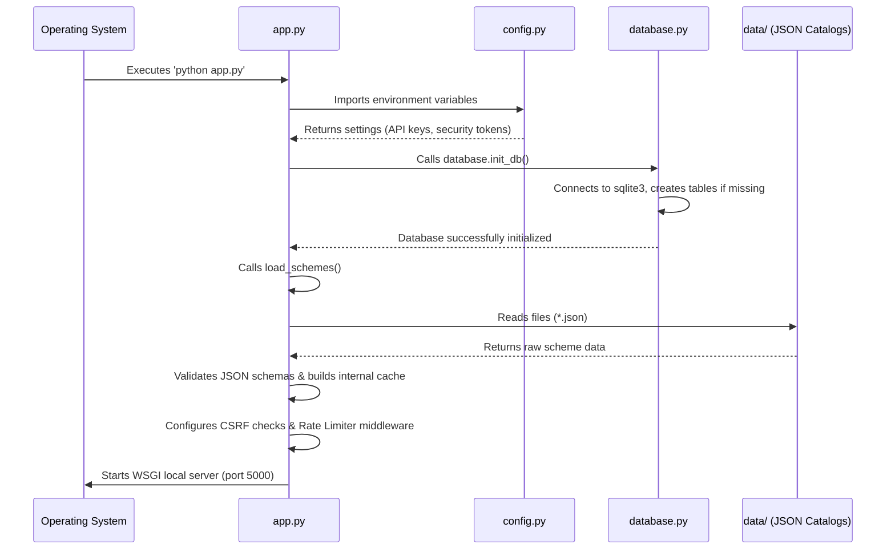
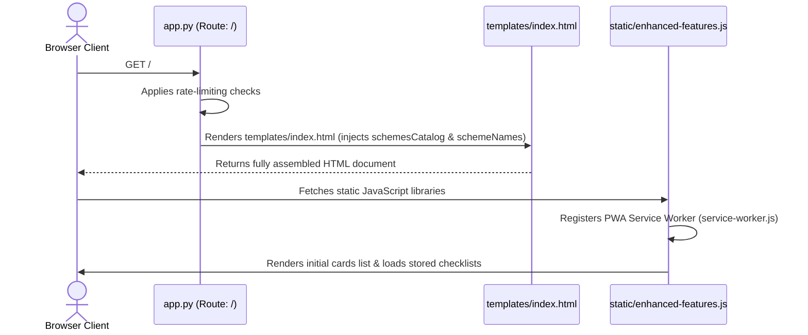
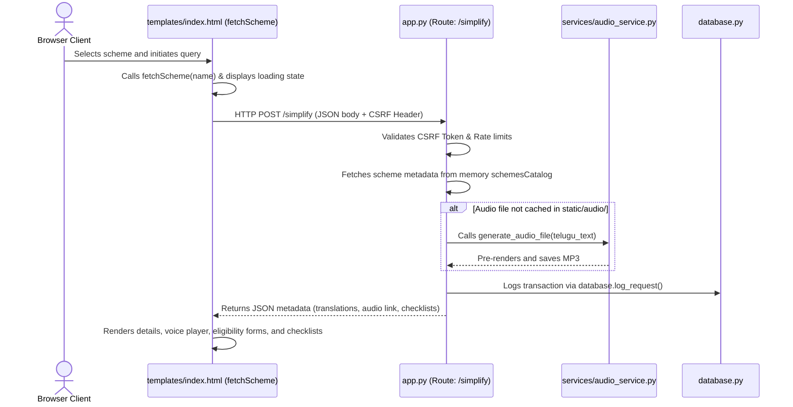
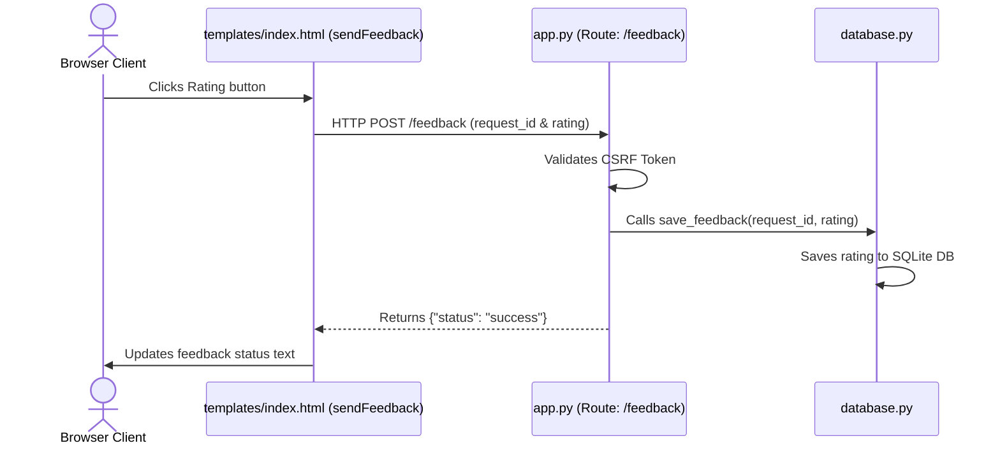

# SmartGovAI: Execution Flow Dictionary

## Table of Contents
1. [Phase 1: Application Initialization (Startup Sequence)](#phase-1-application-initialization-startup-sequence)
2. [Phase 2: Client Access and Page Load](#phase-2-client-access-and-page-load)
3. [Phase 3: Scheme Request and Execution](#phase-3-scheme-request-and-execution)
4. [Phase 4: Feedback Submission and Evaluation](#phase-4-feedback-submission-and-evaluation)

---

## Phase 1: Application Initialization (Startup Sequence)

Upon execution of the application by the system administrator (e.g., via `python app.py` or the execution of `start_app.bat`), the runtime environment initializes through the following sequential operations:

1. **Environment Configuration**:
   * The `app.py` module initializes the runtime by importing essential external dependencies (Flask, Flask-WTF, Flask-Limiter).
   * The `config.py` module parses environmental configurations to extract authentication keys, cryptographic secrets, and Redis connection strings.
2. **Database Verification**:
   * `app.py` invokes the `init_db()` subroutine from `database.py`.
   * The `init_db()` function establishes a connection to the local SQLite file (`feedback.db`) and executes Data Definition Language (DDL) statements to ensure the existence of the `requests`, `feedback`, and `audit_logs` relational tables.
3. **Data Ingestion and Validation**:
   * `app.py` invokes the `load_schemes()` subroutine.
   * The routine enumerates the `data/` directory, reading every `.json` file (explicitly ignoring schema definition files).
   * It validates each scheme definition against the constraints defined in `scheme_schema.json`.
   * Validated entries are merged into a unified, in-memory global catalog (`schemesCatalog`), and the keys are aggregated into an accessible list (`schemeNames`).
4. **Middleware Binding**:
   * The system configures the `Flask-Limiter` instance (utilizing Redis if active, or degrading to local memory storage).
   * Cryptographic protection headers are bound via `CSRFProtect(app)`.
   * The local Web Server Gateway Interface (WSGI) server binds and begins listening for HTTP traffic on port `5000`.

---

## Phase 2: Client Access and Page Load

When a client navigates to the application URL within a browser environment:

1. **Route Resolution**:
   * The inbound HTTP GET request triggers the `@app.route('/')` mapping, executing the `index()` controller function.
2. **Template Compilation**:
   * The `index()` function queries the rate limiting middleware to verify that the client has not exceeded access thresholds.
   * The server renders `templates/index.html`, passing `schemesCatalog` and `schemeNames` as context parameters to the rendering engine.
   * The Jinja2 engine compiles the template: serializing the scheme list as JSON inside script tags and rendering the dropdown options alphabetically.
3. **Frontend Initialization**:
   * The client browser receives the compiled HTML document and dispatches subsequent requests for static assets, including `static/style.css` and `static/enhanced-features.js`.
   * `static/enhanced-features.js` executes and registers `static/service-worker.js` to facilitate offline caching protocols.
   * The script queries the `localStorage` API to restore any previously persisted document checklists or user answers.
   * The initial array of scheme cards is rendered to the Document Object Model (DOM) via `renderSchemeCards()`.

---

## Phase 3: Scheme Request and Execution

When a user selects a scheme from the interface and initiates the query:

1. **Client-Side Trigger**:
   * The interaction calls the `fetchScheme(schemeName)` subroutine within `templates/index.html`.
   * The DOM state is mutated to render a loading indicator.
   * An asynchronous `POST` fetch request is dispatched to `/simplify`, transmitting the `scheme_name` within a JSON payload and forwarding the CSRF token via the `X-CSRFToken` request header.
2. **Controller Handling**:
   * The `app.py` controller intercepts the request at `/simplify`.
   * CSRF middleware validates the header token against the server-side session hash.
   * The controller confirms the existence of the requested scheme name within the local `schemesCatalog`.
3. **Auditory Synthesis Verification**:
   * The controller parses the scheme's localized (Telugu) description.
   * A sanitized, deterministic filename is computed for the TTS audio file.
   * If the file is absent from the `static/audio/` directory, the controller invokes `generate_audio_file()` from `services/audio_service.py`, which communicates with Google TTS servers to render and locally persist the MP3 asset.
4. **Audit Logging Execution**:
   * The controller invokes `log_request()` within `database.py` to insert transactional metadata into the SQLite database.
5. **View Update Resolution**:
   * The controller responds with a JSON payload containing the scheme data (localized text, English text, audio URI, authoritative URLs, required checklists, and eligibility interrogatives).
   * The `fetchScheme()` subroutine receives the JSON payload, evaluates it for HTTP errors, and calls `displayResult()`.
   * `displayResult()` injects the formatted HTML components into the `#resultArea` DOM node and restores any associated state data from `localStorage`.

---

## Phase 4: Feedback Submission and Evaluation

When the user provides qualitative or quantitative feedback via the interface:

1. **Client Request Dispatch**:
   * The interaction triggers the `sendFeedback(rating)` function within the frontend script.
   * An asynchronous `POST` fetch request is dispatched to the `/feedback` endpoint, transmitting the active `request_id` and the quantitative score, secured by the `X-CSRFToken` header.
2. **Feedback Ingestion**:
   * `app.py` intercepts the request at `/feedback`.
   * CSRF middleware validates the request authenticity.
   * The controller invokes `save_feedback(request_id, rating)` from `database.py`, executing an SQL INSERT statement to persist the rating within the SQLite database.
3. **Interface Confirmation**:
   * The controller returns a success vector: `{"status": "success"}`.
   * The client browser updates the `#feedbackStatus` DOM node to confirm receipt of the submission.
